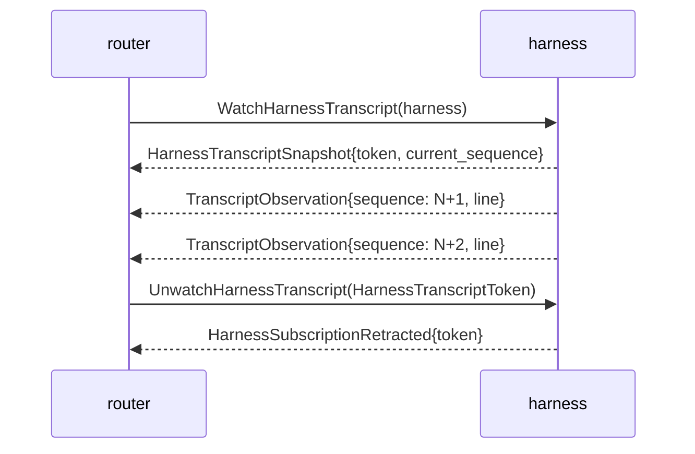

# signal-harness — architecture

*The Signal contract between `router` and `harness` —
bidirectional delivery, interaction, and observation channel.*

## 0 · TL;DR

`signal-harness` carries the delivery channel between the
router and one or more harness instances. The router asks for
delivery, interaction, cancellation, status, and transcript
observation; the harness pushes acks, interaction resolutions,
status, lifecycle events, generic adapter events, and
transcript-observation events.

## Three-layer wire shape

This contract implements the three-layer model affirmed
2026-05-20 per
`primary/reports/designer/246-v4-bundled-fix-deep-design-with-examples.md`
and `primary/reports/designer/248-three-layer-changes-for-operators.md`.

**Layer 1 — Contract Operations on the wire (this crate).** The frame
layer is `signal-frame`, and the public roots are contract-local
operation heads: `MessageDelivery`, `InteractionPrompt`,
`DeliveryCancellation`, `HarnessStatusQuery`,
`WatchHarnessTranscript`, and `UnwatchHarnessTranscript`. No request
root is a universal `SignalVerb` or a Sema classification word such as
`Assert`, `Match`, `Subscribe`, or `Retract`.

**Mandatory `Tap`/`Untap` for persona components.** The harness is a
persona component, so its observable surface is standardized.
The harness's transcript stream is a domain observation opened by
`WatchHarnessTranscript` and closed by `UnwatchHarnessTranscript`.
The standardized observer hook (operation/effect events) is a
separate mandatory surface that persona-introspect subscribes to
uniformly across every persona daemon; it remains the next contract
addition.

**Layer 2 — Component Commands (harness daemon).** The
harness owns its typed Command enum (e.g.
`HarnessCommand::QueueMessageDelivery`,
`HarnessCommand::RecordInteractionResolution`,
`HarnessCommand::ReadHarnessStatus`,
`HarnessCommand::OpenTranscriptStream`) plus a `CommandExecutor`
that knows the harness's tables.

**Layer 3 — Sema classification (signal-sema).** Each Component
Command projects to a payloadless `SemaOperation` class via
`ToSemaOperation`. Persona-introspect filters cross-component
activity by class. The harness does not import payload-bearing Sema
variants.

**Frame layer.** The dependency is `signal-frame`; this contract no
longer depends on `signal-core`. Because this contract still owns NOTA
round-trip witnesses, it explicitly enables `signal-frame/nota-text`
through its own default `nota-text` feature instead of relying on text
codecs in the frame kernel's default build.

References:
- `primary/reports/designer/246-v4-bundled-fix-deep-design-with-examples.md`
- `primary/reports/designer/248-three-layer-changes-for-operators.md`
- `primary/skills/component-triad.md` §"Verbs come in three layers"
- `primary/skills/contract-repo.md` §"Public contracts use contract-local operation verbs"

Transcript observation is push-based. The router may open multiple
independent subscriptions for the same harness on the
`HarnessTranscriptStream`; the harness emits `TranscriptObservation`
events as transcript lines become visible.

Subscription close follows the canonical five-state lifecycle named
in `~/primary/skills/subscription-lifecycle.md`: a typed request-side
`UnwatchHarnessTranscript` carries the per-stream
`HarnessTranscriptToken`; the harness responds with
`HarnessEvent::HarnessSubscriptionRetracted` echoing the token; the
stream ends after that final ack. The kernel grammar in
`signal-frame/macros/src/validate.rs` enforces that a declared stream
has the declared request-side close operation.

## 1 · Channel

| Side | Component |
|---|---|
| Request side | `router` (sends `MessageDelivery`, `InteractionPrompt`, `DeliveryCancellation`, `HarnessStatusQuery`, `WatchHarnessTranscript`, `UnwatchHarnessTranscript`). |
| Reply / event side | `harness` (emits `Delivery*` acks, interaction resolutions, skeleton honesty, status, lifecycle events, generic adapter events, transcript snapshot, retraction ack, and `TranscriptObservation` events on the open stream). |

Bidirectional steady-state: router sends one request; harness emits
one or more events. Lifecycle events (`HarnessStarted` /
`HarnessStopped` / `HarnessCrashed`) and adapter events
(`AdapterReady`, `AdapterInputAccepted`, `AdapterOutput`,
`AdapterProgress`, `AdapterCompletion`,
`AdapterConfirmationNeeded`, `AdapterStalled`, and `AdapterExited`)
flow without requiring a paired request.

## 2 · Observation channel — subscription lifecycle

The harness is the push primitive for its own transcript state. The
full lifecycle:



Both ends of the close exchange exist:

- **Request close** — `HarnessRequest::UnwatchHarnessTranscript(HarnessTranscriptToken)`
  is the consumer-initiated close operation. The `signal_channel!`
  stream-block grammar (`signal-frame::macros::validate`) requires the
  stream's declared close operation to be present in the request enum.
- **Reply retraction ack** — `HarnessEvent::HarnessSubscriptionRetracted(HarnessSubscriptionRetracted)`
  carries the same token and is the final event a consumer binds its
  in-flight subscribe to before the stream ends.

The pair satisfies the canonical lifecycle: subscribe request,
typed event stream, close/retract request, final acknowledgement
event/reply, stream end. Raw socket close is not semantic protocol.

`TranscriptObservation` carries a monotonic `HarnessTranscriptSequence`
so the subscriber can detect gaps and re-anchor after reconnection.

## 3 · Wire vocabulary

Records local to this contract:

- `HarnessName` (the typed name for one harness instance).
- `HarnessDaemonConfiguration`, `HarnessInstanceConfiguration`,
  `HarnessKind`, `PiRpcJsonlAdapterConfiguration`, `PiRpcModelPattern`,
  and `PiRpcDeliveryMode` (the typed daemon startup records and optional
  Pi RPC/JSONL adapter boundary).
- `MessageSender`, `MessageBody`, `MessageSlot`.
- `MessageDelivery`, `InteractionPrompt`, `DeliveryCancellation`,
  `HarnessStatusQuery`.
- `DeliveryCompleted`, `DeliveryFailed`, `DeliveryFailureReason`.
- `InteractionResolved`.
- `HarnessRequestUnimplemented`, `HarnessUnimplementedReason`,
  `HarnessOperationKind`.
- `HarnessStatus`, `HarnessHealth`, `HarnessReadiness`.
- `HarnessStarted`, `HarnessStopped`, `HarnessCrashed`.
- `AdapterReady`, `AdapterInputAccepted`, `AdapterOutput`,
  `AdapterProgress`, `AdapterCompletion`,
  `AdapterConfirmationNeeded`, `AdapterStalled`, and
  `AdapterExited`.
- `WatchHarnessTranscript`, `HarnessTranscriptToken`,
  `HarnessTranscriptSnapshot`, `HarnessSubscriptionRetracted`,
  `TranscriptObservation`, `HarnessTranscriptSequence`.

Provider-specific TUI behavior stays below this contract. A concrete
adapter owns launch, input formatting, readiness detection, output
classification, prompt-turn completion detection, confirmation prompt
detection, stall classification, and process/session exit detection for
its provider. The generic contract carries only the provider-neutral
events after the adapter observes them. `AdapterCompletion` means one
prompt turn is done; it does not close the session. A long-lived TUI
session exits only when the runtime/provider exits or an explicit
close-if-asked path later asks the adapter to close it. Confirmation
prompts are first-class events; policy decides whether an operator, an
automation rule, or an escalation path answers them.

The `MessageBody` on `MessageDelivery` is provisional. The
destination is a typed Nexus record written in NOTA syntax, not a new
text format.

`HarnessDaemonConfiguration` is the single typed startup record for
`harness-daemon`. The record round-trips through NOTA for authoring and
tooling, but the live daemon receives it only as a signal-encoded/rkyv file
path. It carries harness socket path/mode, supervision socket path/mode, owner
identity, and a `harnesses` list. Each
`HarnessInstanceConfiguration` names one harness instance, its closed
`HarnessKind`, optional terminal socket path, and optional Pi RPC/JSONL
adapter configuration. The Pi adapter record carries command path,
session directory path, optional model pattern, and closed delivery mode
(`Prompt`, `Steer`, `FollowUp`).

## 4 · Harness kinds

`HarnessKind` is the closed kind enum carried on `HarnessBinding`.
Four variants, no `Other`:

```text
HarnessKind
├─ Codex
├─ Claude
├─ Pi
└─ Fixture
```

`Fixture` types a harness whose terminal endpoint is a test fixture
(no real PTY delivery). A fixture harness must surface as
`HarnessKind::Fixture`, not as a generic `Codex` or `Claude` binding;
the kind is the type-level marker that downstream routing and
introspection branch on. The constraint witness asserts the enum is
exactly these four variants.

> Status: destination shape. Current daemon code carries three
> variants (`Codex`, `Claude`, `Pi`); the `Fixture` variant is the
> next contract bump. Fixture identity is currently expressed
> through `HarnessTerminalEndpoint::FixtureOnlyHuman`, which is the
> runtime adapter for fixture delivery, not the kind label.

## 5 · Recipient → harness → terminal resolution

The prototype-one resolution chain:

```text
MessageRecipient (role name, e.g. "designer")
  → HarnessName  (same role-named harness from harness registry)
  → TerminalName (same role-named terminal session, per
                  signal-terminal's TerminalName namespace)
  → terminal-cell session (the cell bound to the role-named terminal)
```

For the message-passing prototype, one `harness-daemon` component
process may own multiple role-named harness instances. The harness
registry maps `MessageRecipient` → `HarnessName` by string equality at
the role-name level; the daemon then dispatches by `HarnessName` to the
matching internal actor/adapter. The `HarnessName` and `TerminalName`
namespaces align: a harness named `"designer"` writes into the terminal
session named `"designer"`. Future cases (multiple harnesses per role,
harness pools, separate identity/transport namespaces) get a richer
resolution when they surface.

## 6 · Messages

```text
HarnessRequest                          HarnessEvent
├─ MessageDelivery                      ├─ DeliveryCompleted
├─ InteractionPrompt                    ├─ DeliveryFailed { reason }
├─ DeliveryCancellation                 ├─ InteractionResolved
├─ HarnessStatusQuery                   ├─ HarnessRequestUnimplemented
├─ WatchHarnessTranscript               ├─ HarnessStatus
└─ UnwatchHarnessTranscript(token)       ├─ HarnessStarted
                                        ├─ HarnessStopped
                                        ├─ HarnessCrashed
                                        ├─ AdapterReady
                                        ├─ AdapterInputAccepted
                                        ├─ AdapterOutput
                                        ├─ AdapterProgress
                                        ├─ AdapterCompletion
                                        ├─ AdapterConfirmationNeeded
                                        ├─ AdapterStalled
                                        ├─ AdapterExited
                                        ├─ HarnessTranscriptSnapshot
                                        └─ HarnessSubscriptionRetracted(token)

HarnessStreamEvent (on HarnessTranscriptStream)
└─ TranscriptObservation

HarnessDaemonConfiguration
├─ domain_socket_path / domain_socket_mode
├─ engine_management_socket_path / engine_management_socket_mode
├─ owner_identity
└─ harnesses: Vec<HarnessInstanceConfiguration>

HarnessInstanceConfiguration
├─ harness_name
├─ harness_kind
├─ terminal_socket_path: Option<TerminalSocketPath>
└─ pi_rpc_adapter: Option<PiRpcJsonlAdapterConfiguration>

PiRpcJsonlAdapterConfiguration
├─ command_path: PiRpcCommandPath
├─ session_directory_path: PiRpcSessionDirectoryPath
├─ model_pattern
└─ delivery_mode: PiRpcDeliveryMode
```

Closed enums; typed `DeliveryFailureReason` (four variants:
`TransportRejected`, `HumanInputIntervened`,
`HarnessStoppedBeforeDelivery`, `HarnessUnavailable`).
`HarnessOperationKind` is the closed request discriminator used by
skeleton honesty events.

## 7 · Sema-class projections (Layer 3)

Once migrated, each Component Command projects to a payloadless Sema
class for observation:

```text
MessageDelivery               -> write class for new harness work
InteractionPrompt             -> write class for new interaction prompt
DeliveryCancellation          -> close/cancel class for pending work
HarnessStatusQuery            -> read class for harness status
WatchHarnessTranscript        -> stream-open class for HarnessTranscriptStream
UnwatchHarnessTranscript      -> stream-close class for HarnessTranscriptStream
Tap (future observability)    -> stream-open class for HarnessObserverStream
Untap (future observability)  -> stream-close class for HarnessObserverStream
```

The wire form carries the contract-local verb only; the Sema class
label is computed at observation publish time inside the daemon, not
encoded into the request.

## 8 · Constraints

| Constraint | Witness |
|---|---|
| A harness skeleton answers `HarnessStatusQuery` with typed health and readiness. | Round-trip witness on `HarnessStatus` reply. |
| A valid request that reaches a skeleton harness daemon but is not implemented yet returns `HarnessRequestUnimplemented`. | `harness_request_unimplemented_round_trips_*`. |
| `HarnessRequestUnimplemented.operation` is a closed `HarnessOperationKind`, not a string. | Source review + round-trip witness. |
| Skeleton honesty uses `HarnessUnimplementedReason`, not free text. | Source review + round-trip witness. |
| Prompt cleanliness and input gates stay below this contract in `signal-terminal`. | Source scan: no prompt or gate vocabulary defined here. |
| Transcript observation is pushed, not polled. | The harness's internal transcript event count is not the observation surface; `TranscriptObservation` on `HarnessTranscriptStream` is the only sanctioned way to read transcript progress. |
| Subscription open returns a typed `HarnessTranscriptSnapshot` carrying the per-stream token and the current sequence pointer. | Round-trip witness on the snapshot reply; integration witness in `harness` proves the snapshot is the first event a subscriber receives. |
| Subscription deltas push as typed `TranscriptObservation` events; consumers do not re-ask for current state. | Source scan: no Match-shaped polling variant exists for transcript state. |
| Subscription close uses the canonical lifecycle: request-side `UnwatchHarnessTranscript` carries the token, plus reply-side `HarnessSubscriptionRetracted` echoes the token. | The `signal_channel!` declaration names `operation UnwatchHarnessTranscript(HarnessTranscriptToken)` and a `stream HarnessTranscriptStream { close UnwatchHarnessTranscript; … }` block. The kernel grammar in `signal-frame/macros/src/validate.rs` rejects a `stream` block whose close operation is not a request-side variant. `unwatch_harness_transcript_round_trips` and `harness_subscription_retracted_round_trips` are the wire witnesses. |
| `TranscriptObservation` carries a monotonic `HarnessTranscriptSequence` so the subscriber can detect gaps and re-anchor after reconnection. | Round-trip witness on the sequence field; the harness integration witness asserts strictly-increasing sequence across multiple deltas. |
| `HarnessKind` is closed: `Codex`, `Claude`, `Pi`, `Fixture` — no `Other` variant. | Exhaustive match witness (test fires when a new variant lands; `Fixture` is the next bump). |
| Wire enums contain no `Unknown` variant. | Source scan + per-enum exhaustive-match round-trip witnesses. |
| Any record name containing the word `Unknown` represents a positive "entity not in our state" rejection, not a polling-shape escape hatch. | This crate has no such records. |
| Each variant's NOTA head matches the contract-local verb declared in `signal_channel!`. | Generated by the macro; round-trip tests assert each variant's head. Sema classification is daemon-side projection only. |
| Round-trip witnesses cover every variant in rkyv. | `tests/round_trip.rs` covers every request, reply, and event variant through `Frame::encode_length_prefixed` / `decode_length_prefixed`. |
| Round-trip witnesses cover every variant in NOTA. | `examples/canonical.nota` holds one canonical text example per request/reply/event variant; round-trip tests parse and re-emit each. |
| TUI adapter observations stay provider-neutral. | Adapter events name readiness, accepted input, output, progress, completion, confirmation-needed, stalled, and exit without Claude-, Codex-, Pi-, or terminal-cell-specific variants. |
| Prompt-turn completion does not imply session closure. | `AdapterCompletion` is distinct from `HarnessStopped`, `HarnessCrashed`, and `AdapterExited`; no close request is paired to completion. |
| Confirmation prompts are first-class interaction events. | `AdapterConfirmationNeeded` round-trips as a `HarnessEvent` with a typed interaction identifier, prompt text, and options. |
| No stringly-typed dispatch (`match s.as_str()`) for closed-set states. | All kind / reason / health / readiness fields are typed closed enums. |
| Contract crate dependencies use a named API reference (branch or tag), not a raw revision pin. | `Cargo.toml` review: `signal-frame` is declared `git = "..."` with a named-branch shape; raw `rev = "..."` pins are not used. |
| Runtime code stays out of the contract. | Source scan: no Kameo, Tokio, socket, or redb code. |

## 9 · NOTA codec shape on `signal_channel!` variants

The current `signal_channel!` macro emits the request/reply/event
variant head and wraps the payload's positional fields. For example,
`HarnessRequest::UnwatchHarnessTranscript(HarnessTranscriptToken { .. })`
encodes as `(UnwatchHarnessTranscript (...))`. Canonical examples
and round-trip tests carry the variant heads.

## 10 · Versioning

`signal_frame::Frame` carries the protocol version. Schema-level
changes are breaking; coordinate `router` and
`harness` on the upgrade.

This crate depends on `signal-frame` via a named-branch reference, not
a raw revision pin. The destination is a stable `signal-frame` API
branch/bookmark once that lane is declared.

## 11 · Non-ownership

- No router daemon — that is `router`.
- No harness daemon — that is `harness`.
- No PTY adapter or terminal transport — that is `terminal`,
  below the `signal-terminal` contract.
- No terminal prompt cleanliness or input-gate enforcement. Those
  are `signal-terminal`, `terminal`, and
  `terminal-cell` concerns.
- No transport (UDS path, reconnect, timeouts).

## 12 · Code map

```text
src/
└── lib.rs                — payloads + signal_channel! invocation
examples/
└── canonical.nota         — one canonical example per request/reply/event variant
tests/
└── round_trip.rs          — per-variant frame round trips + NOTA witnesses
                             + closed-enum + verb-mapping witnesses
                             + canonical examples parser
                             + full subscribe/event/retract/ack lifecycle witness
```

## See also

- `~/primary/skills/subscription-lifecycle.md` — canonical
  five-state FSM the transcript-observation stream implements.
- `~/primary/skills/component-triad.md` §"Verbs come in three layers".
- `signal-frame/macros/src/validate.rs` — the macro and stream-block
  grammar that enforces the request-side retract variant.
- `signal-message/ARCHITECTURE.md` — upstream channel
  producing the messages this channel delivers.
- `signal-terminal/ARCHITECTURE.md` — terminal contract for
  harness/terminal PTY coordination; downstream from this channel
  and a sibling using the same subscription discipline.
- `signal-system/ARCHITECTURE.md` and
  `signal-criome/ARCHITECTURE.md` — sibling contracts using the same
  subscription discipline.
