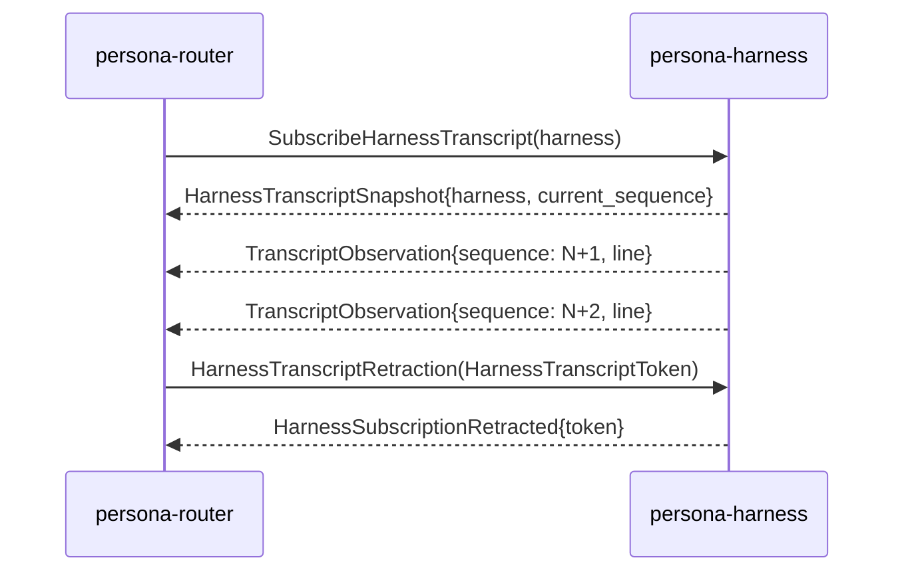

# signal-persona-harness — architecture

*The Signal contract between `persona-router` and `persona-harness` —
bidirectional delivery, interaction, and observation channel.*

## 0 · TL;DR

`signal-persona-harness` carries the delivery channel between the
router and one or more harness instances. The router asks for
delivery, interaction, cancellation, status, and transcript
observation; the harness pushes acks, interaction resolutions,
status, lifecycle events, and transcript-observation events.

## MUST IMPLEMENT — signal architecture migration

This contract is migrating to contract-local verbs per
`primary/reports/designer/238-signal-architecture-redirection-contract-local-verbs.md`
and `primary/reports/designer/239-signal-architecture-migration-plan.md`.

Drop the SignalVerb prefixes on every request variant. Candidate
contract-local verbs by current variant: `Deliver` (for
`MessageDelivery`, payload `Message`), `Prompt` (for
`InteractionPrompt`, payload names the prompt shape), `Cancel`
(for `DeliveryCancellation`, payload names the in-flight delivery
identifier — `Retract` is not the public action; cancelling is),
`Query` (for `HarnessStatusQuery`, payload names the status shape),
`Watch` (for `SubscribeHarnessTranscript` — payload names the
transcript subscription target; `Subscribe` is a Sema verb), and
`Unwatch` (for `HarnessTranscriptRetraction` — the public action is
unsubscribing). Drop the redundant `Harness*` prefix where the
crate namespace already supplies it (e.g. `HarnessStatusQuery` →
the payload of `Query` is `Status`; `HarnessTranscriptRetraction`
payload becomes `TranscriptToken`). Move the verb-to-Sema lowering
into the runtime executor.

Open question for the designer: the close-stream pair (`Unwatch` +
ack reply) needs to remain compatible with the
`subscription-lifecycle` Path-A discipline. The `signal_channel!`
stream-block grammar currently requires a request-side `Retract`
variant; that grammar may need to evolve so the close verb is
contract-local (`Unwatch`) while the daemon still lowers it to
`Subscribe`/`Retract` Sema effects internally. Surface that to the
designer pass on the macro before the operator picks this up.

References: `primary/reports/designer/238-signal-architecture-redirection-contract-local-verbs.md`,
`primary/reports/designer/239-signal-architecture-migration-plan.md`.

**Note to remover:** when the refactor lands, remove this section and
add a `## Migration history — contract-local verbs (2026-05-XX)`
paragraph noting the shape change.

Transcript observation is push-based. The router subscribes once per
harness on the `HarnessTranscriptStream`; the harness emits
`TranscriptObservation` events as transcript lines become visible.

Subscription close follows the canonical five-state lifecycle named
in `~/primary/skills/subscription-lifecycle.md`: a typed request-side
`Retract HarnessTranscriptRetraction` carries the per-stream
`HarnessTranscriptToken`; the harness responds with
`HarnessEvent::HarnessSubscriptionRetracted` echoing the token; the
stream ends after that final ack. The kernel grammar at
`signal-core/macros/src/validate.rs:303–331` enforces the
close-is-Retract shape.

## 1 · Channel

| Side | Component |
|---|---|
| Request side | `persona-router` (sends `MessageDelivery`, `InteractionPrompt`, `DeliveryCancellation`, `HarnessStatusQuery`, `SubscribeHarnessTranscript`, `HarnessTranscriptRetraction`). |
| Reply / event side | `persona-harness` (emits `Delivery*` acks, interaction resolutions, skeleton honesty, status, lifecycle events, transcript snapshot, retraction ack, and `TranscriptObservation` events on the open stream). |

Bidirectional steady-state: router sends one request; harness emits
one or more events. Lifecycle events (`HarnessStarted` /
`HarnessStopped` / `HarnessCrashed`) flow without paired requests.

## 2 · Observation channel — subscription lifecycle

The harness is the push primitive for its own transcript state. The
full lifecycle:



Both ends of the close exchange exist:

- **Request retraction** — `HarnessRequest::HarnessTranscriptRetraction(HarnessTranscriptToken)`
  is the consumer-initiated close operation. The `signal_channel!`
  stream-block grammar (`signal-core::macros::validate`) requires a
  request-side `Retract` variant for any declared `stream` block.
- **Reply retraction ack** — `HarnessEvent::HarnessSubscriptionRetracted(HarnessSubscriptionRetracted)`
  carries the same token and is the final event a consumer binds its
  in-flight subscribe to before the stream ends.

The pair satisfies the canonical lifecycle: subscribe request,
typed event stream, close/retract request, final acknowledgement
event/reply, stream end. Raw socket close is not semantic protocol.

`TranscriptObservation` carries a monotonic `HarnessTranscriptSequence`
so the subscriber can detect gaps and re-anchor after reconnection.

## 3 · Wire vocabulary

Records local to this contract:

- `HarnessName` (the typed name for one harness instance).
- `MessageSender`, `MessageBody`, `MessageSlot`.
- `MessageDelivery`, `InteractionPrompt`, `DeliveryCancellation`,
  `HarnessStatusQuery`.
- `DeliveryCompleted`, `DeliveryFailed`, `DeliveryFailureReason`.
- `InteractionResolved`.
- `HarnessRequestUnimplemented`, `HarnessUnimplementedReason`,
  `HarnessOperationKind`.
- `HarnessStatus`, `HarnessHealth`, `HarnessReadiness`.
- `HarnessStarted`, `HarnessStopped`, `HarnessCrashed`.
- `SubscribeHarnessTranscript`, `HarnessTranscriptToken`,
  `HarnessTranscriptSnapshot`, `HarnessSubscriptionRetracted`,
  `TranscriptObservation`, `HarnessTranscriptSequence`.

The `MessageBody` on `MessageDelivery` is provisional. The
destination is a typed Nexus record written in NOTA syntax, not a new
text format.

## 4 · Harness kinds

`HarnessKind` is the closed kind enum carried on `HarnessBinding`.
Four variants, no `Other`:

```text
HarnessKind
├─ Codex
├─ Claude
├─ Pi
└─ Fixture
```

`Fixture` types a harness whose terminal endpoint is a test fixture
(no real PTY delivery). A fixture harness must surface as
`HarnessKind::Fixture`, not as a generic `Codex` or `Claude` binding;
the kind is the type-level marker that downstream routing and
introspection branch on. The constraint witness asserts the enum is
exactly these four variants.

> Status: destination shape. Current daemon code carries three
> variants (`Codex`, `Claude`, `Pi`); the `Fixture` variant is the
> next contract bump. Fixture identity is currently expressed
> through `HarnessTerminalEndpoint::FixtureOnlyHuman`, which is the
> runtime adapter for fixture delivery, not the kind label.

## 5 · Recipient → harness → terminal resolution

The prototype-one resolution chain:

```text
MessageRecipient (role name, e.g. "designer")
  → HarnessName  (same role-named harness from harness registry)
  → TerminalName (same role-named terminal session, per
                  signal-persona-terminal's TerminalName namespace)
  → terminal-cell session (the cell bound to the role-named terminal)
```

One harness per role for prototype one. The harness registry maps
`MessageRecipient` → `HarnessName` by string equality at the
role-name level. The `HarnessName` and `TerminalName` namespaces
align: a harness named `"designer"` writes into the terminal session
named `"designer"`. Future cases (multiple harnesses per role,
harness pools, separate identity/transport namespaces) get a richer
resolution when they surface.

## 6 · Messages

```text
HarnessRequest                          HarnessEvent
├─ MessageDelivery                      ├─ DeliveryCompleted
├─ InteractionPrompt                    ├─ DeliveryFailed { reason }
├─ DeliveryCancellation                 ├─ InteractionResolved
├─ HarnessStatusQuery                   ├─ HarnessRequestUnimplemented
├─ SubscribeHarnessTranscript           ├─ HarnessStatus
└─ HarnessTranscriptRetraction(token)   ├─ HarnessStarted
                                        ├─ HarnessStopped
                                        ├─ HarnessCrashed
                                        ├─ HarnessTranscriptSnapshot
                                        └─ HarnessSubscriptionRetracted(token)

HarnessStreamEvent (on HarnessTranscriptStream)
└─ TranscriptObservation
```

Closed enums; typed `DeliveryFailureReason` (three variants:
`TransportRejected`, `HumanInputIntervened`,
`HarnessStoppedBeforeDelivery`). `HarnessOperationKind` is the closed
request discriminator used by skeleton honesty events.

## 7 · Signal root verbs

```text
MessageDelivery               -> Assert
InteractionPrompt             -> Assert
DeliveryCancellation          -> Retract
HarnessStatusQuery            -> Match
SubscribeHarnessTranscript    -> Subscribe   (opens HarnessTranscriptStream)
HarnessTranscriptRetraction   -> Retract     (closes HarnessTranscriptStream)
```

Delivery and interaction prompts assert new harness work. Cancellation
retracts pending work. Status is a read and must not be wrapped as
`Assert`. Transcript subscription opens the
`HarnessTranscriptStream`; the request-side retraction variant closes
it and the reply-side `HarnessSubscriptionRetracted` is the final ack.

## 8 · Constraints

| Constraint | Witness |
|---|---|
| A harness skeleton answers `HarnessStatusQuery` with typed health and readiness. | Round-trip witness on `HarnessStatus` reply. |
| A valid request that reaches a skeleton harness daemon but is not implemented yet returns `HarnessRequestUnimplemented`. | `harness_request_unimplemented_round_trips_*`. |
| `HarnessRequestUnimplemented.operation` is a closed `HarnessOperationKind`, not a string. | Source review + round-trip witness. |
| Skeleton honesty uses `HarnessUnimplementedReason`, not free text. | Source review + round-trip witness. |
| Prompt cleanliness and input gates stay below this contract in `signal-persona-terminal`. | Source scan: no prompt or gate vocabulary defined here. |
| Transcript observation is pushed, not polled. | The harness's internal transcript event count is not the observation surface; `TranscriptObservation` on `HarnessTranscriptStream` is the only sanctioned way to read transcript progress. |
| Subscription open returns a typed `HarnessTranscriptSnapshot` carrying the per-stream token and the current sequence pointer. | Round-trip witness on the snapshot reply; integration witness in `persona-harness` proves the snapshot is the first event a subscriber receives. |
| Subscription deltas push as typed `TranscriptObservation` events; consumers do not re-ask for current state. | Source scan: no Match-shaped polling variant exists for transcript state. |
| Subscription close uses the canonical lifecycle: a request-side `Retract HarnessTranscriptRetraction` carrying the token, plus a reply-side `HarnessSubscriptionRetracted` ack echoing the token. | The `signal_channel!` declaration names `Retract HarnessTranscriptRetraction(HarnessTranscriptToken)` and a `stream HarnessTranscriptStream { close HarnessTranscriptRetraction; … }` block. The kernel grammar (`signal-core/macros/src/validate.rs:303–331`) rejects a `stream` block whose `close` is not a request-side `Retract` variant. `harness_transcript_retraction_round_trips` and `harness_subscription_retracted_reply_round_trips` are the wire witnesses. |
| `TranscriptObservation` carries a monotonic `HarnessTranscriptSequence` so the subscriber can detect gaps and re-anchor after reconnection. | Round-trip witness on the sequence field; the persona-harness integration witness asserts strictly-increasing sequence across multiple deltas. |
| `HarnessKind` is closed: `Codex`, `Claude`, `Pi`, `Fixture` — no `Other` variant. | Exhaustive match witness (test fires when a new variant lands; `Fixture` is the next bump). |
| Wire enums contain no `Unknown` variant. | Source scan + per-enum exhaustive-match round-trip witnesses. |
| Any record name containing the word `Unknown` represents a positive "entity not in our state" rejection, not a polling-shape escape hatch. | This crate has no such records. |
| Every `signal_channel!` request variant has a typed `signal_verb()` mapping. | `signal-core` generates `HarnessRequest::signal_verb()`; round-trip tests assert each variant's expected root. |
| Round-trip witnesses cover every variant in rkyv. | `tests/round_trip.rs` covers every request, reply, and event variant through `Frame::encode_length_prefixed` / `decode_length_prefixed`. |
| Round-trip witnesses cover every variant in NOTA. | `examples/canonical.nota` holds one canonical text example per request/reply/event variant; round-trip tests parse and re-emit each. |
| No stringly-typed dispatch (`match s.as_str()`) for closed-set states. | All kind / reason / health / readiness fields are typed closed enums. |
| Contract crate dependencies use a named API reference (branch or tag), not a raw revision pin. | `Cargo.toml` review: `signal-core` is declared `git = "..."` with a named-branch shape; raw `rev = "..."` pins are not used. |
| Runtime code stays out of the contract. | Source scan: no Kameo, Tokio, socket, or redb code. |

## 9 · NOTA codec quirk on `signal_channel!` payload heads

The `signal_channel!` macro emits a request variant's NOTA head as
the **payload's record head**, not the Rust variant name. For
example, `HarnessRequest::HarnessTranscriptRetraction(HarnessTranscriptToken { .. })`
encodes as `(HarnessTranscriptToken (...))`, not
`(HarnessTranscriptRetraction ...)`. Canonical examples and
round-trip tests carry the payload heads.

## 10 · Versioning

`signal_core::Frame` carries the protocol version. Schema-level
changes are breaking; coordinate `persona-router` and
`persona-harness` on the upgrade.

This crate depends on `signal-core` via a named-branch reference, not
a raw revision pin. The destination is a stable `signal-core` API
branch/bookmark once that lane is declared.

## 11 · Non-ownership

- No router daemon — that is `persona-router`.
- No harness daemon — that is `persona-harness`.
- No PTY adapter or terminal transport — that is `persona-terminal`,
  below the `signal-persona-terminal` contract.
- No terminal prompt cleanliness or input-gate enforcement. Those
  are `signal-persona-terminal`, `persona-terminal`, and
  `terminal-cell` concerns.
- No transport (UDS path, reconnect, timeouts).

## 12 · Code map

```text
src/
└── lib.rs                — payloads + signal_channel! invocation
examples/
└── canonical.nota         — one canonical example per request/reply/event variant
tests/
└── round_trip.rs          — per-variant frame round trips + NOTA witnesses
                             + closed-enum + verb-mapping witnesses
                             + canonical examples parser
                             + full subscribe/event/retract/ack lifecycle witness
```

## See also

- `~/primary/skills/subscription-lifecycle.md` — canonical
  five-state FSM the transcript-observation stream implements.
- `signal-core/src/channel.rs` — the macro and stream-block grammar
  that enforces the request-side retract variant.
- `signal-persona-message/ARCHITECTURE.md` — upstream channel
  producing the messages this channel delivers.
- `signal-persona-terminal/ARCHITECTURE.md` — terminal contract for
  harness/terminal PTY coordination; downstream from this channel
  and a sibling using the same subscription discipline.
- `signal-persona-system/ARCHITECTURE.md` and
  `signal-criome/ARCHITECTURE.md` — sibling contracts using the same
  subscription discipline.
